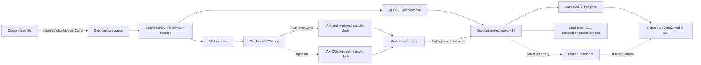
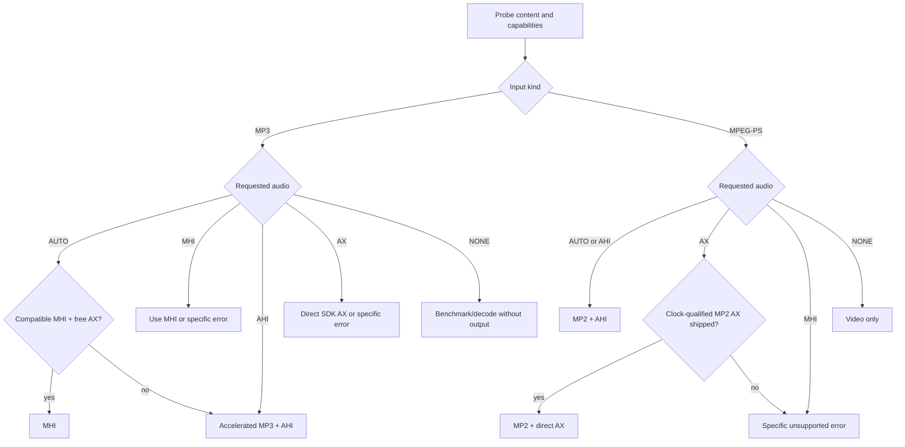
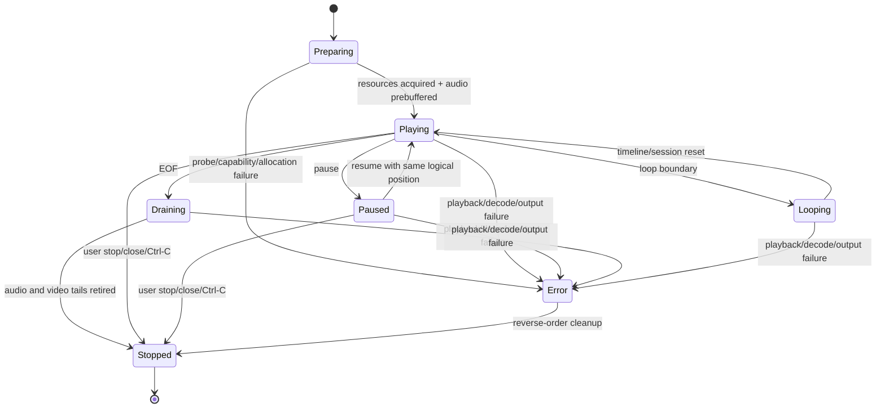

# Flagship `zzplay` Media Player

## Execution status — 2026-07-30

- U1–U3 are implemented on `feat/zzplay-media`: the player has testable
  seams, the additive media-session ABI is in place, and MPEG-1 Program
  Stream MP2/timeline decoding is integrated.
- The direct-AX portion of U4 is hardware-passed on default Zorro III with
  firmware `b0e9967` and SDK `a75ff78`. The r9 fixture completed 300/300
  frames with zero presentation drops in 12.301 seconds at 24.424 fps; the
  post-run MHI ownership smoke passed.
- U4 is not globally complete. The generic AHI path remains required for
  systems without ZZ9000AX, and its current synchronous submission cost does
  not meet the real-time playback contract. Long-run drift, pause/resume,
  loop, abort/error cleanup, and resource-leak qualification also remain.
- The recommended next implementation item is therefore the generic-AHI
  scheduling/submission fix within U4, followed by the remaining U4 hardware
  matrix. U5–U9 remain pending.

## Goal Capsule

### Objective

Turn `zzplay` from a minimal MPEG-1 video client into the polished,
hardware-first ZZ9000 media player for v2.8: synchronized MPEG-1 Program
Stream video and MP2 audio, standalone accelerated MP3 playback, optional MHI
support for ZZ9000AX, clear generic fallbacks, robust player controls, and
measurably optimized presentation.

The flagship native path must keep decoded video off the Zorro bus. Literal
decode-plane-to-scanout zero-copy is a bounded feasibility goal, not a claim
about the current implementation: current firmware packs planar420 frames
into a card-local YUY2 staging surface before native VDMA scanout.

### Authority hierarchy

1. The user's settled product decisions and repository `AGENTS.md` files.
2. The Product Contract in this plan.
3. The Planning Contract and implementation-unit dependency order.
4. Existing repository conventions where the plan leaves implementation
   detail open.

If current code disproves an assumption, preserve the product contract and
update the technical approach rather than silently weakening behavior.

### Execution profile

- Depth: Deep, cross-repository, test-first.
- Repositories: `zz9000-sdk`, `zz9000-firmware`, and `zz9000-drivers`.
- Primary product home: `zz9000-sdk`.
- Release tail: merge and focused hardware qualification first; coordinated
  v2.8 identities, pins, artifacts, and RC tags only after the feature gates
  pass.
- Hardware posture: default Zorro III is the local physical gate. RC1 requests
  community Zorro II qualification; final v2.8 waits for positive Zorro II
  confirmation.

### Stop conditions

Stop and surface a blocker rather than guessing if:

- a proposed ABI change would alter an existing opcode's layout or legacy
  video-session behavior;
- an AHI or direct-AX implementation cannot expose an actual played-sample
  clock, distinct from PCM merely staged ahead of DMA;
- an optimization is not bit-exact against the scalar oracle or regresses a
  representative end-to-end workload;
- a true planar FPGA path fails xsim, timing, variant builds, or physical
  validation;
- MHI support would require copying GPLv2-only RiVA source into the GPLv3-only
  SDK;
- Zorro II video is accidentally advertised despite the driver not exposing
  the P96 overlay there; or
- a required hardware decision would materially expand formats or release
  scope beyond this Product Contract.

## Product Contract

### Summary

`zzplay` is the end-user media player for the ZZ9000 stack. It should choose
the fastest valid path for the detected board and installed audio hardware,
tell the user which path it selected, and fail or fall back predictably when a
capability is absent or busy. `zz9k-mp3` remains a decode/export diagnostic.
RiVA remains an independent post-v2.8 integration track.

### Problem frame

The current `zzplay` is a video-only MPEG-1 Program Stream prototype. It has
no program audio, no A/V clock, no standalone MP3 playback, minimal controls,
CLI-only launch, and limited runtime diagnostics. The current stack already
contains most primitives—core-1 MPEG decode, accelerated MP3 sessions, P96
overlay presentation, AHI, MHI, and an AX playback pump—but they are not
composed into one coherent player.

Performance claims also need precision. The native path already avoids
returning decoded video to the 68k, but core 1 still packs decoded planar420
into card-local YUY2, and resized or clipped windows use a card-local RGB
software compositor instead of the native plane. The new player must measure
and expose those boundaries.

### Actors

- **A1 — Base ZZ9000 user:** wants accelerated MPEG/MP3 playback through
  standard Amiga audio without requiring ZZ9000AX.
- **A2 — ZZ9000AX user:** wants the lowest-copy supported audio path and may
  select MHI or direct AX when compatible.
- **A3 — Developer/bench operator:** needs deterministic fixtures, stage
  counters, uncapped benchmarks, and exact backend/path reporting.
- **A4 — Zorro II RC tester:** validates the supported audio subset and clean
  rejection of Zorro-III-only video capabilities.

### Product key decisions

- **PD1 — Productize `zzplay`, keep RiVA separate.** `zzplay` becomes the
  supported v2.8 player; RiVA is a clean-room feature/interaction reference
  and later consumer of stable interfaces.  
  `session-settled: user-approved; rejected: making unanswered upstream RiVA
  work a v2.8 dependency`  
  Governs R1, R2, R6, R15.

- **PD2 — Keep the `zzplay` name.** Its product contract now genuinely covers
  both video and audio media, so a rename would create churn without improving
  clarity.  
  `session-settled: user-approved; rejected: renaming before broadening the
  tool`  
  Governs R1, R2, R15.

- **PD3 — MHI is optional, not mandatory.** Standalone MP3 works without
  ZZ9000AX through accelerated decode plus AHI; MHI is available on compatible
  AX systems and remains Layer III only.  
  `session-settled: user-directed; rejected: requiring ZZ9000AX or routing
  Program Stream MP2 through MHI`  
  Governs R2–R5.

- **PD4 — Optimize for ZZ9000 hardware and prove it.** The default native
  video path keeps decoded pixels off Zorro, and optimization decisions are
  driven by counters, exact-output tests, and end-to-end benchmarks.  
  `session-settled: user-directed; rejected: accepting a generic
  software-player architecture or unmeasured SIMD`  
  Governs R8–R12.

- **PD5 — Zorro II is RC-qualified by users.** RC1 may ship after software
  qualification and default-Z3 hardware validation; reported Zorro II defects
  are fixed in RC2 or later, and final v2.8 waits for positive confirmation.  
  `session-settled: user-directed; rejected: blocking RC1 on unavailable local
  Zorro II hardware or claiming unperformed qualification`  
  Governs R16.

### Requirements

#### Media formats

- **R1 — MPEG-1 Program Stream:** Play the first supported MPEG-1 video stream
  and first MPEG-1 Layer II audio stream from an MPEG-1 Program Stream.
  Video-only streams play with a warning; unsupported explicitly requested
  audio fails clearly.
- **R2 — Standalone MP3:** Play CBR and VBR Layer III files, including mono and
  stereo sources, while retaining `zz9k-mp3` as the raw/WAV decode diagnostic.
- **R3 — Content detection:** Select the media pipeline from probed content,
  not only filename extensions. Reject elementary video, standalone MP2,
  MPEG-2, and malformed or unsupported inputs without leaking resources.

#### Audio backends and ownership

- **R4 — Backend selection:** Support `AUTO`, `AHI`, `MHI`, `AX`, and `NONE`.
  `AUTO` may fall back before playback begins; an explicitly selected backend
  must either be used or return a specific error.
- **R5 — Backend compatibility:** For standalone MP3, `AUTO` prefers MHI when
  a compatible free ZZ9000AX and `mhizz9000.library` are available, otherwise
  uses accelerated decode plus AHI. For Program Stream MP2, `AUTO` uses AHI;
  direct AX is offered only if an actual playback clock and complete
  pause/drain/ownership behavior are implemented. MHI is never offered for
  MP2.
- **R6 — Exclusive AX ownership:** Acquire exactly one output backend before
  playback. MHI, `zz9000ax.audio`, legacy audio, and direct AX must not steal
  the daughterboard from one another. `BUSY` is visible, fallback is
  deterministic, and teardown permits immediate acquisition by the next
  owner.

#### Player behavior

- **R7 — Unified transport:** Provide play, pause/resume, stop, loop,
  fullscreen/window toggle, free window resize with aspect-correct content,
  close-window/Ctrl-C handling, and a stable state machine across MPEG and MP3.
  Support CLI arguments, Workbench project arguments and ToolTypes, and an ASL
  requester when launched interactively without a file.
- **R8 — A/V synchronization:** Use actually played audio samples as the
  master clock. Prebuffer before first presentation; hold early video; decode
  reference frames even when late; discard only presentation of sufficiently
  late frames; recover after pause or underrun without rewinding or speeding
  audio. Use timer pacing only for video-only playback.

#### Hardware-first presentation and optimization

- **R9 — Zero-Zorro video contract:** On the accelerated Zorro III path,
  decoded video bytes crossing Zorro must remain zero. Never introduce a 68k
  decoded-frame round trip or full-screen 68k software composition.
- **R10 — Presentation-path honesty:** Fully visible 1:1 video uses the native
  FPGA overlay. Resized or clipped video may use the existing card-local ARM
  compositor and must report the path transition. Fullscreen should choose a
  1:1 native mode where practical; otherwise it reports card-local scaling.
- **R11 — Runtime evidence:** Report selected media/audio/video backends,
  compressed input bytes, video/MP2 decode work, card-local pack/composite
  bytes and time, presentation counts, late/dropped frames, audio queue and
  underruns, current/max A/V drift, decoded video bytes transferred over
  Zorro, and resource cleanup totals.
- **R12 — Profile-guided optimization:** Profile the complete pipeline before
  changing kernels. A NEON path ships only when it is scalar-bit-exact,
  improves its measured hot kernel by at least 10% or the representative
  end-to-end pipeline by at least 5%, and does not regress any representative
  fixture or player workload.
- **R13 — Planar scanout feasibility:** Investigate eliminating the
  planar420-to-YUY2 card-local pack with a true planar decode-to-scanout FPGA
  path. Ship it only after functional simulation, timing, all seven variant
  builds, and default-Z3 physical validation. Failure of this gate retains the
  optimized card-local pack and the precise “zero decoded video over Zorro”
  claim; it does not block RC1.

#### SDK and release integration

- **R14 — Palette query:** Port the historical primary-CLUT query behavior to
  current firmware and SDK without merging stale branches. Use the next free
  library vector, update every ABI/LVO mirror and identity, test it on the
  host, and validate it on hardware. This does not by itself promise 8-bit
  overlay composition.
- **R15 — Compatibility and packaging:** Preserve all legacy video and MP3
  APIs, capability-gate new services, provide version-specific diagnostics,
  package `zzplay` as both a CLI and Workbench-capable application, document
  formats/backends/controls/path claims, and update component versions only
  after the final ABI is stable.
- **R16 — Release qualification:** Pass software gates in all affected
  repositories, default-Z3 focused and combined hardware gates, and the
  community Zorro II contract before final v2.8. On Zorro II, validate MP3
  audio backends where hardware permits and a precise unsupported-video error;
  do not promise the Zorro-III-only P96 overlay.

### Key flows

- **F1 — MPEG playback:** Probe Program Stream → verify Z3/P96 and media
  service capabilities → create window/overlay → claim chosen audio backend →
  create one media session → prebuffer → present from the audio clock → drain
  audio and final video → teardown in reverse order.
- **F2 — MP3 automatic playback:** Probe MP3 → try compatible free MHI on AX →
  otherwise create accelerated MP3 session and AHI sink → play with shared
  controls → drain → release the sole audio owner.
- **F3 — Explicit backend:** Validate the requested backend against the media
  type before allocation → either acquire exactly that backend or return a
  specific unsupported/missing/busy error → never silently substitute.
- **F4 — Interactive lifecycle:** Normalize CLI/WBArgs/ToolTypes/ASL input →
  `PREPARING` → `PLAYING` ↔ `PAUSED` → `DRAINING` or `LOOPING` →
  `STOPPED`; any error enters a single reverse-order cleanup path.
- **F5 — Benchmark/qualification:** Run with audio disabled unless explicitly
  requested → distinguish decode from presentation throughput → emit
  path/backend/copy/sync/resource counters and artifact identity suitable for
  an RC report.

### Acceptance examples

- **AE1 — Generic MPEG:** Given a default-Z3 system without ZZ9000AX, when an
  MPEG-1 Program Stream with MP2 audio is opened in `AUTO`, then video uses
  the accelerated overlay, audio uses AHI, the title/stats identify both, and
  steady A/V drift remains within the success threshold.
- **AE2 — MP3 with free AX:** Given a compatible free ZZ9000AX and installed
  MHI library, when an MP3 is opened in `AUTO`, then MHI is selected and no
  PCM is copied back to the 68k. If MHI cannot be acquired before playback,
  `AUTO` may fall back to accelerated decode plus AHI and reports why.
- **AE3 — Forced MHI on MPEG:** Given an MPEG Program Stream, when the user
  explicitly requests MHI, then playback does not start and the player reports
  that MHI supports MP3/Layer III rather than Program Stream MP2.
- **AE4 — Resize path:** Given fully visible exact-size native playback, when
  the window becomes scaled or clipped, then playback remains correct,
  switches to the card-local compositor, reports the change, and transfers no
  decoded video over Zorro. Restoring 1:1 visibility returns to native.
- **AE5 — Busy AX:** Given AHI already owns ZZ9000AX, when explicit MHI or AX
  is requested, then the request returns `BUSY`, does not disrupt AHI, and a
  later retry succeeds after AHI closes.
- **AE6 — Zorro II:** Given a matched Zorro II RC stack, when MPEG video is
  requested, then the player reports the missing Z3 P96 overlay without
  hanging. Standalone MP3 remains available through the compatible audio
  backend and repeated close/reopen leaves no host-window leak.

### Success criteria

- The exact accelerated path reports zero decoded video bytes over Zorro.
- A 352×288/25 fps and a 640×480/30 fps representative Program Stream sustain
  real-time playback under normal Workbench load with no monotonically growing
  drift; 352×288 has no steady-state presentation drops and 640×480 drops
  fewer than 1% after startup.
- After a two-second startup/resume grace period, steady-state A/V drift stays
  within one video frame or 40 ms, whichever is greater; non-error transients
  stay within 80 ms and recover to the steady bound within two seconds.
- A 30-minute playback run, 20 loop transitions, and 100 pause/resume cycles
  leave zero live SDK sessions, PIP surfaces, shared buffers, or audio owners,
  with immediate successful reopen.
- Scalar and optimized decoder/presentation paths produce byte-identical
  fixture output. Only optimizations satisfying R12 remain enabled.
- CLI, Workbench project-icon, ToolType, requester, backend-failure, truncated
  input, and normal EOF paths produce clear results and complete cleanup.

### Scope boundaries

In v2.8:

- MPEG-1 Program Stream video, MP2 program audio, and standalone MP3 only;
- native video acceleration remains Zorro III capability-gated;
- supported display composition remains 15/16/32-bit; palette query is not an
  implicit 8-bit YUV-to-pen implementation; and
- MHI remains an optional runtime integration.

Deferred:

- MPEG-1 elementary streams, standalone MP2, MJPEG, MPEG-2, and newer codecs;
- playlists, random-access video seeking, subtitles, and streaming URLs;
- direct RiVA integration or copying RiVA source;
- an 8-bit scaled/clipped YUV-to-pen compositor; and
- physical qualification of non-default board variants beyond RC community
  feedback.

### Dependencies and sources

- Current player and pure seams: `tools/zzplay.c`,
  `tools/zzplay-probe.h`, `tools/zzplay-stream.h`,
  `tools/zzplay-stats.h`.
- MP3 transport precedent: `tools/zz9k-mp3.c`.
- Video ABI and host calls: `include/zz9k/abi.h`,
  `host/include/zz9k/host.h`, `host/include/zz9k/request.h`,
  `host/include/zz9k/reply.h`, `host/src/zz9k_host.c`.
- Firmware video and overlay: `ZZ9000_proto.sdk/ZZ9000OS/src/sdk_video_*`,
  `ZZ9000_proto.sdk/ZZ9000OS/src/sdk_mailbox.*`,
  `ZZ9000_proto.sdk/ZZ9000OS/src/overlay.c`.
- Audio ownership precedents: firmware `sdk_mailbox.c`, drivers
  `mhi/mhizz9000.c`, `ahi/driver/zz9000ax-ahi.c`, and
  `ahi/duplextest/ZZAXDuplexTest.c`.
- P96 constraints: drivers `rtg/mntgfx-gcc.c` and
  `rtg/tests/overlay_feature_test.c`.
- Historical palette behavior only: SDK commits `a9c7a08` and `789abd8`;
  firmware commit `6ff4bb1`.
- Release policy: handover `00-INDEX.md`,
  `05-zorro2-zz9000ax-regressions.md`,
  `08-sdk-backlog-and-pending-prs.md`,
  `13-zzplay-media-player.md`, and
  `15-current-master-hardware-validation.md`.

## Planning Contract

### Key technical decisions

- **KTD1 — Refactor around testable player seams before adding behavior.**
  Keep `tools/zzplay.c` as thin Amiga orchestration and split content probing,
  media transport, video sink, audio sink, clock/sync, controls, and statistics
  into focused C99 modules. First characterize existing playback and preserve
  it through the split. This prevents AHI, MHI, P96, and timer lifecycles from
  becoming one larger monolith. Governs U1 and U6.

- **KTD2 — Add an independent, backward-compatible media session.** Preserve
  every existing `VIDEO_SESSION_*` opcode, payload, and immediate-presentation
  behavior. Add `MEDIA_SESSION_*` operations that reuse the current video
  backend internally but let one Program Stream demux own both video and MP2,
  expose audio/timeline state, and separate decode from present/discard.
  Repurposing the MP3 audio-stream service would split a single demux and lose
  Program Stream timing; changing legacy video operations would regress the
  shipped `zzplay`/P96 contract. Governs R1, R8, R15; U2–U4.

- **KTD3 — One demux owns both elementary streams and their timeline.** The
  firmware media session demuxes the first supported video and MP2 streams,
  preserves or derives integer timestamps on a common timebase, and defines
  behavior for missing, discontinuous, or offset PTS. Do not run two
  independent demuxers over the same input or depend on high-level
  `plm_decode()` timing that does not preserve streaming packet-to-output
  attribution. Governs R1, R8; U3.

- **KTD4 — Actual output consumption is the audio clock.** AHI reports samples
  played from its refill/player lifecycle. Direct AX reports samples retired
  by DMA after subtracting queued latency. `pcm_read`,
  `pcm_consumed_total`, bytes staged into a TX ring, and feeder progress are
  not playback time and must never drive video. Video-only media uses the
  timer clock. Governs R8; U4.

- **KTD5 — Backend policy is resolved before playback.** Use the matrix in
  R4–R6. Only `AUTO` may substitute a backend, only before `PLAYING`, and
  exactly one owner remains open. MHI is a runtime adapter through its public
  API, not a compile-time dependency on drivers-internal headers. Governs U5.

- **KTD6 — Decode and presentation have independent lifetimes.** Media decode
  always advances reference-frame state, but a result is explicitly held,
  presented, or discarded according to the master clock. Decoder-owned planes
  remain valid until the presentation/discard acknowledgement retires them.
  Legacy video sessions keep their current automatic presentation behavior.
  Governs R8–R10; U2–U4.

- **KTD7 — “Zero copy” is decomposed into auditable boundaries.** The required
  v2.8 contract is zero decoded video bytes over Zorro. Current planar-to-YUY2
  packing and resized/clipped RGB composition are card-local work and receive
  separate counters. True planar PL scanout is an optional gated subproject;
  it is removed cleanly if any R13 gate fails. Governs U7.

- **KTD8 — Scalar output is the optimization oracle.** Keep scalar and NEON
  kernels independently callable in host/firmware tests. Compare complete
  planes, YUY2 output, and PCM exactly across normal, interpolation-edge,
  coefficient-extreme, corrupt, and truncated fixtures. Benchmark scheduling,
  feed batching, backpressure, and copies before SIMD because they can dominate
  an already real-time decoder. Governs R11–R13; U7.

- **KTD9 — Palette query is a focused additive port.** Retain the historical
  primary CLUT reply shape (`0x00RRGGBB`) and free service opcode where
  compatible, allocate the next non-conflicting public LVO after `-306`,
  raise library revision/call count, and update all mirrors and source tests.
  Do not claim this provides YUV-to-pen composition. Governs R14; U8.

- **KTD10 — RiVA is clean-room reference material.** Reproduce user-visible
  controls and lifecycle behavior from observations and public behavior only.
  Do not copy GPLv2-only RiVA source or make its unanswered upstream PRs part of
  this delivery. Governs R7, R15; U1 and U6.

- **KTD11 — Versions and downstream pins move only after behavior stabilizes.**
  Finish ABI and player work, run focused tests, then update SDK identities,
  pin the exact SDK commit in drivers, update changed driver identities, and
  bump firmware runtime to 2.8 during release freeze. Governs R15–R16; U9.

### High-level technical design

The diagrams show ownership and required boundaries, not exact C APIs.



Decoded video never follows an arrow back over Zorro. The AHI audio fallback
necessarily transfers PCM; MHI/direct AX can keep standalone-MP3 PCM card-side.





### Media-session contract

The exact opcode numbers and packed field offsets are implementation details,
but the service must expose these semantic operations:

- begin/probe one MPEG-1 Program Stream media session;
- feed compressed bytes and signal EOF with backpressure;
- decode until a video frame, audio availability, input demand, done, or
  error;
- query or read MP2 PCM with sample format, produced/acknowledged cursors,
  timestamps, and counters;
- bind/unbind the session PCM source to the codec-neutral AX pump when the
  qualified direct path exists;
- explicitly present or discard the current decoded video frame;
- query playback/status counters without mutating lifetime;
- close idempotently from any partially initialized state.

Results use fixed-width, big-endian ABI fields and an additive capability bit.
Existing opcode values and payload sizes do not change. SDK and firmware
mirrors must remain mechanically comparable.

### Synchronization policy

- Establish a common integer timebase from Program Stream timestamps. When
  timestamps are absent, derive a monotonic timeline from decoded sample
  counts and nominal video rate; record that fallback in stats.
- Prebuffer enough audio to avoid immediate underrun without adding more than
  the documented startup latency.
- The sink supplies `played_samples`, not submitted or decoded samples. Convert
  this to media time plus the stream's initial audio offset.
- Present a frame when due. Hold an early frame without allowing its storage
  to be reused. When late beyond the configured one-frame tolerance, retire it
  without presentation but continue decoding dependent frames.
- Pause freezes presentation and audio advancement. Resume retains logical
  position, re-establishes the sink clock, and enters the bounded recovery
  window in Success Criteria.
- On audio underrun, stop advancing the audio master; do not make video run
  ahead. On discontinuity, reset the local mapping once and report it rather
  than accumulating correction oscillation.
- Drain to actual audio completion at EOF. Do not truncate PCM already queued
  in AHI or AX.

### Player/module boundaries

The implementer may adjust filenames to fit build conventions, but preserve
these responsibilities:

- `zzplay.c`: CLI/Workbench entry and top-level orchestration only.
- player options/input module: CLI, WBArgs, ToolTypes, ASL, content sniffing.
- media module: SDK media/MP3 session transport and backpressure.
- video sink: P96 window/feature lifecycle, geometry, native/fallback path.
- audio sink interface: common played-sample, pause, drain, stop contract.
- AHI, MHI, and optional direct-AX adapters: backend-specific ownership only.
- sync module: media timeline, prebuffer, hold/present/discard policy.
- stats module: monotonic counters and report formatting.
- control module: transport state machine and IDCMP/Ctrl-C handling.

Pure state, option, backend-choice, and sync logic must compile in host tests
without Amiga headers.

### System-wide impact

- **ABI:** Adds a media-session capability and operations across public SDK,
  host helpers, firmware mirrors, scheduler routing, and diagnostics. Legacy
  video/audio ABI stays byte-for-byte compatible.
- **Scheduler:** Program Stream demux, video decode, and MP2 decode remain one
  core-1-affine session. Core-0 retires completions and controls presentation
  without publishing a frame before the player decides.
- **Memory:** Adds bounded media audio/timestamp state within the existing
  memory-map discipline. No allocation may overlap Z3 fast RAM or weaken the
  full-cache-flush coherency rule.
- **P96/RTG:** Uses the existing one-overlay feature and driver capability
  gate. Busy or unsupported video must not affect desktop state. 1:1 native
  and scaled/clipped compositor paths remain distinguishable.
- **Audio:** AHI transfers PCM to a system-selected mode; MHI and direct AX
  retain existing exclusive ownership. Testing must sequence mutually
  exclusive owners.
- **Build/package:** SDK gains more player sources and Workbench metadata.
  Drivers consumes the exact SDK pin and installs documentation/icon payloads.
- **Release claims:** “Zero decoded video over Zorro” is valid on both
  card-local native and compositor paths; “decode-plane-to-scanout zero-copy”
  is valid only if the optional planar PL gate ships.

### Sequencing

1. Characterize and modularize current player behavior.
2. Land the additive media ABI and exact MP2/timestamp firmware tests.
3. Add explicit video presentation and audio output clocks, then A/V sync.
4. Add AHI and optional direct AX for Program Stream audio.
5. Integrate standalone MP3 and optional MHI through the common player.
6. Complete controls, Workbench launch, diagnostics, and failure cleanup.
7. Profile and optimize the full pipeline; separately gate planar FPGA
   feasibility.
8. Port palette query on the stabilized ABI.
9. Package, document, validate hardware, then perform version/pin/release
   administration.

Units must not be merged across these dependency boundaries merely to reduce
commit count. Experimental planar HDL and rejected SIMD attempts must be
removed rather than left disabled in production source.

### Risks and mitigations

| Risk | Consequence | Mitigation |
| --- | --- | --- |
| Staging cursor mistaken for playback time | Stable-looking but audible/visible A/V offset and drift | KTD4; instrument actual AHI callbacks and AX DMA retirements; long-run offset fixtures |
| Legacy video session changed in place | Existing player/client regression | New additive media session; ABI layout/source tests; legacy fixture remains exact |
| One demux loses PTS attribution while streaming | Wrong initial offset or discontinuity handling | Explicit timestamp mapping layer and fixtures with missing/non-zero/discontinuous PTS |
| AHI/MHI/AX double ownership | Lost or corrupted audio, disrupted other apps | Resolve one backend before playback; atomic busy handling; sequential ownership tests |
| Decoder frame reused before presentation | Flicker, wrong frame, or corruption | Explicit present/discard acknowledgement and lifetime tests |
| “Zero-copy” marketing exceeds implementation | Misleading release and untestable claims | Separate Zorro-transfer, pack, composite, and PL counters; R9/R13 terminology |
| NEON rounding differs from scalar | Pixel or audio corruption | Byte-exact oracle, independent kernel seam, discard any failing optimization |
| Planar PL work destabilizes formatter/variants | Release regression outside player | Optional bounded gate with xsim, timing, seven variants, physical test; clean fallback |
| Workbench UI work entangles media engine | Hard-to-test lifecycle failures | Pure state/options core and thin OS adapters |
| Zorro II scope is misunderstood | RC reports treated as failed promised video | Explicit unsupported-video result and audio-subset checklist |

## Implementation Units

### U1. Characterize and modularize the existing player

**Goal:** Create a behavior-preserving, host-testable player core before
adding formats, audio, or UI behavior.

**Requirements:** R3, R7, R15; F4–F5; KTD1, KTD10.

**Dependencies:** None.

**Files:**

- SDK modify: `tools/zzplay.c`, `tools/zzplay-probe.h`,
  `tools/zzplay-stream.h`, `tools/zzplay-stats.h`,
  `scripts/build-m68k-amigaos.sh`,
  `scripts/build-m68k-amigaos.ps1`, `CMakeLists.txt`.
- SDK create: focused player modules under `tools/` for options/state,
  media transport, video sink, audio sink contract, sync, controls, and
  statistics.
- SDK tests: extend `tests/zzplay_probe_test.c`; create
  `tests/zzplay_core_test.c`, `tests/zzplay_backend_test.c`, and a
  source/build wiring test if needed.

**Approach:**

- Record current MPEG probe results, capability errors, benchmark behavior,
  P96 allocation order, Ctrl-C/close behavior, and statistics output.
- Extract pure structures and state transitions first. Keep all AmigaOS/P96
  calls behind adapters, preserving the current exact-size playback path.
- Normalize option parsing into one representation that later accepts CLI,
  ToolTypes, and Workbench arguments.
- Give every resource an acquired flag/handle and one reverse-order cleanup
  function that is safe after partial initialization.

**Test scenarios:**

- Existing valid MPEG fixture produces the same probe width, height, rate, and
  video-only playback decisions before and after the split.
- Invalid/truncated header, unsupported board, absent P96 capability, PIP
  busy, Ctrl-C, window close, EOF, and allocation failure each reach one
  terminal state and release only acquired resources.
- Backend-policy unit tests cover every media/backend cell, including
  explicit-vs-auto fallback and MP2/MHI rejection.
- Benchmark defaults to audio disabled and does not imply real-time pacing.

**Verification:**

- New host tests pass under strict C99.
- AmigaOS cross-build still produces a working video-only `zzplay`.
- Default-Z3 smoke reproduces current exact-size MPEG video output and clean
  close/reopen before U2 changes the media contract.

### U2. Add the backward-compatible media-session ABI

**Goal:** Define one additive Program Stream service that can carry video,
MP2, timestamps, explicit presentation, and output-clock state without
changing legacy video/audio operations.

**Requirements:** R1, R8, R11, R15; F1; KTD2, KTD6.

**Dependencies:** U1.

**Files:**

- SDK modify: `include/zz9k/abi.h`, `include/zz9k/caps.h`,
  `host/include/zz9k/host.h`, `host/include/zz9k/request.h`,
  `host/include/zz9k/reply.h`, `host/src/zz9k_host.c`.
- SDK tests: `tests/abi_layout_test.c`,
  `tests/request_builder_test.c`, `tests/reply_decoder_test.c`,
  `tests/host_mailbox_test.c`, `tests/host_mailbox_source_test.c`,
  `tests/video_session_abi_test.c`; create
  `tests/media_session_abi_test.c`.
- Firmware modify:
  `ZZ9000_proto.sdk/ZZ9000OS/src/sdk_mailbox.h`,
  `ZZ9000_proto.sdk/ZZ9000OS/src/sdk_mailbox.c`,
  `ZZ9000_proto.sdk/ZZ9000OS/src/scheduler.c`,
  `ZZ9000_proto.sdk/ZZ9000OS/src/scheduler.h`,
  and service/module metadata mirrors.
- Firmware tests: `util/test_sdk_codec_service.c`,
  `util/test_sdk_service_flags.c`, `test/scheduler/`.

**Approach:**

- Allocate new operations and one capability flag; retain all existing opcode
  values, payload sizes, and behavior.
- Carry session handle, media state, result flags, input consumption, video
  dimensions/rate/timestamp, MP2 format/ring state/timestamp, present/discard
  state, and diagnostic counters with fixed-width fields.
- Route blocking demux/decode work to the current core-1-affine scheduler
  model. Keep lightweight present/discard and status retirement on core 0.
- Make close and status safe in every state, including failed begin and
  partially drained EOF.
- Add an automated SDK/firmware mirror check wherever the current repo checks
  service constants and payload sizes.

**Test scenarios:**

- Legacy video-session requests and result bytes remain unchanged and their
  exact fixture still passes.
- Every new request builder writes expected endian fields; reply decoding
  rejects the wrong opcode, invalid state, out-of-range flags, or truncated
  payload.
- Begin/write/decode/present/discard/status/close sequences cover normal,
  input-starved, output-backpressured, done, cancelled, and error states.
- A second media session is refused without affecting the first; closing twice
  is harmless; a deferred request is reclaimed after cancellation.
- Capability-off behavior returns a specific unsupported result that old
  firmware/SDK combinations can diagnose.

**Verification:**

- SDK ABI/layout/request/reply/host tests pass.
- Firmware codec-service, service-flag, scheduler, reclaim, and routing tests
  pass.
- ABI mirror values match exactly, and legacy smoke behavior is unchanged.

### U3. Implement MPEG-PS MP2 decode and timestamp mapping

**Goal:** Decode MPEG-1 video and Layer II audio from one streaming demux with
deterministic PCM and timeline results.

**Requirements:** R1, R3, R8, R11; F1; KTD3.

**Dependencies:** U2.

**Files:**

- Firmware modify:
  `ZZ9000_proto.sdk/ZZ9000OS/src/sdk_video_backend.h`,
  `ZZ9000_proto.sdk/ZZ9000OS/src/sdk_video_stream.c`,
  `ZZ9000_proto.sdk/ZZ9000OS/src/sdk_video_stream.h`,
  `ZZ9000_proto.sdk/ZZ9000OS/src/sdk_video_plmpeg.c`,
  `ZZ9000_proto.sdk/ZZ9000OS/src/sdk_mailbox.c`.
- Firmware reference/modify only if needed:
  `ZZ9000_proto.sdk/ZZ9000OS/src/third_party/pl_mpeg/pl_mpeg.h` and
  `README.zz9000.md`.
- Firmware tests: `test/video_codec/video_codec_test.c`; add compact A/V,
  offset, malformed, and truncation fixtures under `test/video_codec/`.

**Approach:**

- Keep one `pl_mpeg` demux instance and enable its existing Layer II decoder.
  Preserve packet timestamps/start offsets in a small mapping layer instead of
  decoding audio in an unrelated MP3 service.
- Store decoded PCM in a bounded card-local ring with explicit produced,
  acknowledged, and dropped/underrun counters. Do not overwrite unacknowledged
  PCM.
- Associate decoded video and audio positions with a common integer timeline;
  define derivation for absent PTS and one-shot rebase for discontinuities.
- Maintain decoder reference state when the client discards presentation.
- Drain partial input, final decoded frame, and PCM tail exactly once at EOF.

**Test scenarios:**

- An exact MPEG-1/MP2 fixture produces the existing video frame hashes plus
  deterministic per-block PCM hashes, sample rate, channel count, and
  timestamps.
- Fixtures cover non-zero audio/video initial offset, missing PTS,
  discontinuous PTS, video-only PS, mono/stereo MP2, supported rates,
  arbitrary feed chunk boundaries, backpressure, truncated packets, malformed
  headers, and EOF tail.
- Discarding a late frame does not alter the hash of later dependent frames.
- Repeated begin/feed/decode/drain/close leaves no session/ring allocation.

**Verification:**

- Firmware video-codec exact-output tests pass in scalar mode.
- Existing five-frame YUY2 hash remains unchanged.
- New fixture results are stable across feed chunk sizes and repeated runs.

### U4. Add output clocks, explicit presentation, and A/V synchronization

**Goal:** Pace video from actual AHI or AX playback, with bounded drift and
correct hold/drop/pause/drain behavior.

**Requirements:** R6, R8–R11; F1, F4–F5; KTD4, KTD6.

**Dependencies:** U3.

**Files:**

- SDK modify/create: player audio-sink, AHI-sink, sync, video-sink, media, and
  statistics modules under `tools/`; `tools/zzplay.c`.
- SDK tests: create `tests/zzplay_sync_test.c`,
  `tests/zzplay_audio_clock_test.c`, and extend
  `tests/zzplay_core_test.c`.
- Firmware modify:
  `ZZ9000_proto.sdk/ZZ9000OS/src/sdk_mailbox.c`,
  `ZZ9000_proto.sdk/ZZ9000OS/src/sdk_mailbox.h`,
  `ZZ9000_proto.sdk/ZZ9000OS/src/ax.c`,
  `ZZ9000_proto.sdk/ZZ9000OS/src/ax.h`,
  `ZZ9000_proto.sdk/ZZ9000OS/src/overlay.c`.
- Firmware tests: `test/audio/`, `test/video/overlay_schedule_test.c`,
  `util/test_sdk_codec_service.c`.

**Approach:**

- Implement a generic audio-sink contract whose clock is monotonically played
  samples and whose lifecycle includes prepare, prebuffer, play, pause,
  resume, drain, stop, and close.
- Build an AHI S16 PCM sink with bounded buffers and a callback/refill-derived
  played-sample counter. Never advance the clock merely because the player
  submitted a buffer.
- Refactor the firmware AX consumer into a codec-neutral PCM-source binding.
  Expose actual DMA-retired frames and queued latency. Enable media-session
  direct AX only after pause, drain, ownership, and clock tests pass.
- Stop automatic overlay publication for new media sessions only. Let the
  player issue present/discard while preserving the legacy path.
- Implement the Synchronization Policy and expose drift/late/underrun events
  without using wall-clock corrections to conceal a bad audio clock.

**Test scenarios:**

- Simulated AHI and AX sinks vary buffer sizes, callback cadence, queue depth,
  start latency, underflow, and pause duration; played time never leads actual
  retirement.
- Video is held when early and discarded without display when sufficiently
  late; intermediate catch-up frames never flash.
- A ten-second pause resumes from the same logical media position; EOF waits
  for the audio tail; loop resets media and clock without window recreation.
- Initial offset, timer-only video, audio-only, underrun, and discontinuity
  scenarios satisfy the Success Criteria and do not oscillate.
- AHI/direct-AX busy, stop, error, and repeated reopen do not leave an owner or
  stale DMA target.

**Verification:**

- Deterministic sync tests prove hold/present/discard decisions at boundary
  timestamps.
- Firmware audio/video/scheduler tests pass.
- Default-Z3 playback stays within the drift/drop targets for the two
  representative streams; direct AX remains disabled if its real clock cannot
  meet the same contract.

### U5. Integrate standalone MP3 and optional MHI

**Goal:** Make MP3 a first-class `zzplay` input with generic AHI playback and
an optional lowest-copy MHI path on ZZ9000AX.

**Requirements:** R2–R6, R11, R15; F2–F3; AE2–AE3, AE5; KTD5.

**Dependencies:** U1, U4.

**Files:**

- SDK modify: `tools/zz9k-mp3.c`, `tools/zzplay.c`, player media/audio/backend
  modules under `tools/`, build scripts, `CMakeLists.txt`.
- SDK create: a reusable MP3 transport/backpressure helper and optional MHI
  adapter using the public MHI API.
- SDK tests: `tests/mp3_tool_logic_test.c`,
  `tests/mp3_tool_source_test.c`, `tests/zzplay_backend_test.c`; add MP3
  transport/MHI-adapter source tests as needed.
- Drivers reference and validate:
  `mhi/mhizz9000.c`, `mhi/mhilib.h`, `mhi/StartUp.c`,
  `ahi/driver/zz9000ax-ahi.c`; modify only if a proven shared-contract defect
  requires it.

**Approach:**

- Extract the existing accelerated MP3 feed/ring/backpressure logic so
  `zz9k-mp3` and `zzplay` share behavior without turning the diagnostic into
  the player.
- Feed decoded PCM to the common AHI sink for the universal path.
- Load MHI at runtime, validate Layer III support, and map player
  pause/resume/stop/loop to the public MHI lifecycle. Keep drivers-internal
  headers out of SDK product sources.
- Apply the backend matrix before playback. Log selection and fallback reason;
  never have MHI and AHI/direct AX open concurrently.
- Preserve MP3 CBR/VBR, mono/stereo, corrupt input, EOF tail, and bounded
  backpressure behavior.

**Test scenarios:**

- Explicit AHI plays CBR/VBR mono/stereo through accelerated decode; explicit
  MHI uses MHI on compatible AX and reports missing library, unsupported
  layer, or busy distinctly.
- `AUTO` selects MHI only when compatible and acquired before playback, then
  falls back to AHI on allowed pre-play failures. Explicit MHI never falls
  back.
- MPEG plus MHI is rejected before media/session allocation.
- MHI → AHI and AHI → MHI sequential handoffs, 20 loops, 100 pause/resume
  cycles, user stop, corrupt input, and EOF all permit immediate reopen.
- `zz9k-mp3` still writes identical raw/WAV output and is documented as a
  diagnostic.

**Verification:**

- SDK MP3/backend tests and Amiga cross-build pass.
- Drivers MHI and AHI builds/tests remain green if touched.
- Default-Z3/AX hardware passes explicit AHI, explicit MHI, `AUTO`, ownership
  refusal, handoff, and cleanup tests without noise or truncated tails.

### U6. Complete the flagship player experience

**Goal:** Deliver consistent controls, Workbench launch, aspect-correct
window/fullscreen behavior, visible status, and clear failures across MPEG and
MP3.

**Requirements:** R3, R7, R10–R11, R15; F4; AE4; KTD1, KTD10.

**Dependencies:** U4, U5.

**Files:**

- SDK modify: `tools/zzplay.c` and player options/control/video/status modules;
  `scripts/build-m68k-amigaos.sh`,
  `scripts/build-m68k-amigaos.ps1`,
  `scripts/package-m68k-amigaos.sh`,
  `scripts/package-m68k-amigaos.ps1`.
- SDK create: Workbench icon metadata/source asset and user documentation
  under `docs/`.
- SDK tests: extend/create option, state, geometry, ToolType parity, build,
  package, and documentation source tests in `tests/`.

**Approach:**

- Map CLI, WBArgs/project drops, ToolTypes, and ASL selection into the same
  validated options. CLI failures use stderr; Workbench failures use a
  requester without requiring a console.
- Define and document controls: Space pause/resume, Escape/Q/close stop, F
  fullscreen/window, L loop, plus Ctrl-C.
- Preserve source aspect ratio with centered letterboxing, remember window
  geometry across fullscreen toggles, and report native 1:1 versus
  scaled/clipped card-local composition.
- Display media type, audio backend, presentation path, paused/buffering/busy
  state, and concise errors. Keep verbose counters behind a stats/benchmark
  option.
- Acquire resources transactionally in F1/F4 order and always unwind in
  reverse.

**Test scenarios:**

- CLI file, Workbench project icon/file drop, tool launch with ASL, and
  ToolType equivalents produce identical normalized options.
- Keyboard, close gadget, Ctrl-C, loop, fullscreen toggle, arbitrary resize,
  clipping, depth/visibility change, and native-video takeover/return maintain
  state and aspect.
- Missing file, requester cancel, unsupported format/board/display depth,
  missing old capability, PIP busy, and every audio-backend error use the
  appropriate UI and complete cleanup.
- Exact-size visibility reports native; resize/clipping reports compositor;
  returning to 1:1 visibility reports native again.

**Verification:**

- Host option/state/geometry/source tests pass.
- Cross-build/package contain the CLI binary, Workbench icon, and help.
- Default-Z3 hardware passes window/fullscreen/resize/move/visibility,
  pause/loop, requester/project-icon, and failure/reopen smoke in 16- and
  32-bit modes; 15-bit is included where available.

### U7. Profile and optimize the hardware pipeline

**Goal:** Remove measured bottlenecks, add only exact beneficial NEON, and
decide the true-planar FPGA path through a bounded evidence gate.

**Requirements:** R9–R13; F5; AE4; KTD7–KTD8.

**Dependencies:** U3, U4, U6.

**Files:**

- Firmware modify:
  `ZZ9000_proto.sdk/ZZ9000OS/src/sdk_video_plmpeg.c`,
  `ZZ9000_proto.sdk/ZZ9000OS/src/sdk_video_yuy2.c`,
  `ZZ9000_proto.sdk/ZZ9000OS/src/sdk_video_yuy2.h`,
  `ZZ9000_proto.sdk/ZZ9000OS/src/overlay.c`,
  and focused new scalar/NEON kernel files if justified.
- Firmware tests: `test/video_codec/video_codec_test.c`,
  `test/video/overlay_schedule_test.c`,
  `test/video/overlay_hw_test.c`, and benchmark fixtures.
- SDK modify: player statistics/benchmark output and associated host tests.
- Conditional HDL only if the planar feasibility checkpoint proceeds:
  relevant overlay/VDMA RTL, `zz9000_project.tcl`, xsim tests under
  `test/video/`, and committed bitstreams under `bootimage_work/`.

**Approach:**

- Establish scalar stage baselines for file input/feed, demux, video decode,
  MP2 decode, YUY2 pack, compositor, present, audio buffer, and sync overhead.
- Optimize chunking, feed batching, backpressure probes, buffer reuse,
  scheduler handoffs, and avoidable copies before introducing NEON.
- Isolate candidate motion-compensation, IDCT, YUY2-pack, and—only if measured
  material—MP2 kernels. Preserve an independently callable scalar oracle and
  correct four-tap averaging/rounding semantics.
- Apply R12 separately to every kernel. Remove variants that fail exactness or
  thresholds; do not keep dead experimental paths.
- Planar checkpoint: design the smallest PL fetcher compatible with
  decoder-owned Y/Cb/Cr pitches and the existing generation/vblank handoff.
  Proceed to committed HDL only if software baselines show the pack is a
  material bottleneck and the design can preserve overlay/key/takeover/cache
  invariants.
- If HDL proceeds, regenerate Vivado projects from source, run the full
  formatter/overlay simulation, rebuild all seven variants, verify timing/DRC,
  inspect synthesis logs for current RTL, and require default-Z3 hardware
  parity. Otherwise retain and optimize the card-local pack.

**Test scenarios:**

- Scalar versus each optimized kernel is byte-identical for the existing five
  video frames, new A/V fixture, every half-pixel interpolation combination,
  coefficient extremes, odd widths, corrupt input, and truncation.
- Benchmarks distinguish kernel, decode-call, uncapped presentation, and paced
  end-to-end results and compare against a recorded pre-change baseline.
- Copy counters prove zero decoded video over Zorro and distinguish
  planar-pack, native scanout, and scaled/clipped compositor work.
- If planar PL proceeds, simulation covers all supported color modes/scales,
  odd widths, keying, generation/vblank flips, DPMS/native takeover, and the
  formatter read-latency phase-lock invariant.
- Representative real-time playback under normal and concurrent network load
  meets Success Criteria with no pixel/hash regression.

**Verification:**

- Exact codec/video tests pass in scalar and selected optimized builds.
- Every shipped optimization meets R12 with captured before/after results.
- Firmware build passes. HDL changes, if any, pass xsim, synthesis,
  implementation, timing, DRC, seven-variant rebuild, and default-Z3 hardware.
- Release wording matches the path actually shipped.

### U8. Port and validate palette query

**Goal:** Restore the focused primary-palette query on current masters with a
non-conflicting public library call and a hardware validation client.

**Requirements:** R14–R15; KTD9.

**Dependencies:** U2; begin after the media ABI allocation is stable.

**Files:**

- SDK modify: `include/zz9k/abi.h`, host request/reply/call headers and source,
  `amiga/src/zz9k_library.c`,
  `amiga/src/zz9k_library_resident.c`,
  `amiga/include/zz9k/library_vectors.h`,
  public `amiga/include/{clib,inline,libraries,pragmas,proto}/` mirrors,
  `amiga/fd/zz9k_lib.fd`.
- SDK create: `tools/zz9k-palette.c` or an equivalently focused validation
  client.
- SDK tests: `tests/abi_layout_test.c`,
  `tests/request_builder_test.c`, `tests/reply_decoder_test.c`,
  `tests/host_mailbox_test.c`, `tests/library_lvo_test.c`,
  `tests/library_resident_lock_test.c`,
  `tests/amiga_library_metadata_test.c`,
  `tests/docs_library_source_test.c`, plus a palette client source test.
- Firmware modify:
  `ZZ9000_proto.sdk/ZZ9000OS/src/sdk_mailbox.h`,
  `ZZ9000_proto.sdk/ZZ9000OS/src/sdk_mailbox.c`.
- Firmware tests: `util/test_sdk_codec_service.c` or a focused service test.

**Approach:**

- Inspect historical commits for intent and tests, then manually port only the
  current primary-CLUT snapshot behavior.
- Retain the free palette service opcode if current allocation confirms it,
  use the next vector after the current `-306`, increase public call count and
  minimum revision, and update every generated/manual mirror together.
- Return a stable 256-entry primary palette in `0x00RRGGBB`, with explicit
  bounds/status and no implication that 8-bit overlay is enabled.
- Add a small client that prints/validates selected entries for release
  hardware evidence; package it only if it is useful beyond the one-time test,
  otherwise keep it in the SDK test/tools payload as documented.

**Test scenarios:**

- Request/reply endian and buffer bounds cover first, middle, and last palette
  entries, invalid length/address, stale generation if applicable, and
  unsupported firmware.
- Old and new LVOs are unique, ordered, count-matched, and resident table/source
  metadata agree.
- Host/service test returns a known synthetic palette exactly.
- Hardware client observes expected colors before and after palette changes,
  RTG mode switches, PIP playback, and the combined stress.

**Verification:**

- SDK ABI, host, library LVO/resident/metadata, docs, and client tests pass.
- Firmware service tests and build pass.
- Default-Z3 hardware returns the correct active primary palette without RTG
  or overlay regression.

### U9. Package, version, pin, and qualify the v2.8 candidate

**Goal:** Ship the completed player/palette stack as a matched, documented,
fingerprinted release candidate without mixing pre-freeze artifacts.

**Requirements:** R15–R16; F5; AE1–AE6; KTD11.

**Dependencies:** U5–U8.

**Files:**

- SDK modify: `README.md`, `docs/zz9k-library.md`,
  `docs/zz9k-release-smoke.md`, player documentation, build/package scripts,
  component version/date sources, `CMakeLists.txt`, and source tests.
- Drivers modify: `sdk/SDK_REF`, `sdk/README.md`, `sdk/build.sh`,
  `README.md`, `RELEASING.md`, installer scripts/help/icons,
  packaging/check-release scripts, changed component version/date sources, and
  `tools/tests/test_repo_tooling.py`.
- Firmware modify: runtime version source at freeze, release notes/docs, and
  release assets only as required by shipped firmware/HDL changes.
- Handover update: the five active v2.8 documents after focused validation and
  again after official-artifact qualification.

**Approach:**

- Update language so `zzplay` is the media player and `zz9k-mp3` is the
  decode/export diagnostic. Document exact formats, backend matrix, ownership,
  controls, Workbench launch, capability errors, native/compositor behavior,
  and zero-copy terminology.
- Run focused software and default-Z3 gates before version churn.
- After ABI stability, set final SDK/library/tool identities, commit the SDK,
  pin that exact commit in drivers, update changed driver identities, and run
  full downstream builds. Bump firmware runtime to 2.8 only on the frozen
  candidate.
- Assemble fresh artifacts and manifest source commits, exact SDK pin, sizes,
  and SHA-256 hashes. Do not reuse pre-freeze binaries as RC payloads.
- Execute the handover preflight, coordinated RC tags only when requested,
  official-artifact combined stress, installer acceptance, and Zorro II RC
  request. Final release follows the settled RC policy.

**Test scenarios:**

- Clean package contains current player binary/icon/docs, SDK runtime, any
  retained palette client, drivers, and correct help text; no stale binary is
  staged.
- Installed CLI and Workbench launches work from the public installer, and
  reported identities/hashes match the manifest.
- Sequential backend gate covers MPEG MP2/AHI, optional MP2/AX, MP3/AHI, and
  MP3/MHI. Combined stress uses muted `zzplay` video while AHI duplex and
  network/AmiSSL run concurrently so exclusive AX owners are not
  double-booked.
- Zorro II RC instructions test MP3/audio subsets, clean MPEG-video rejection,
  repeated close/reopen, P96 stability, HTTPS fallback, and exact artifacts.
- Release notes distinguish default-Z3 physical qualification, seven-variant
  build/timing qualification, and community Zorro II qualification.

**Verification:**

- All repository commands in the Verification Contract pass.
- Focused and combined hardware results meet Success Criteria and are tied to
  exact artifact hashes.
- SDK pin equals the final SDK commit; all three release worktrees are clean;
  no tag/publish action occurs without explicit user instruction.

## Verification Contract

Run commands from the named repository root. Preserve the first failing output
and fix the cause; do not weaken an exact-output or ownership assertion to make
the suite green.

### SDK host and AmigaOS gates

```powershell
cmake -B build-cmake
cmake --build build-cmake
ctest --test-dir build-cmake --output-on-failure
powershell -ExecutionPolicy Bypass -File scripts\build-m68k-amigaos.ps1
powershell -ExecutionPolicy Bypass -File scripts\package-m68k-amigaos.ps1
```

Expected:

- all existing and new ABI, player-core, backend, sync, MP3, LVO, build,
  package, and documentation tests pass;
- AmigaOS build produces `zzplay` and the retained diagnostics without
  unresolved AHI/MHI symbols;
- package manifest contains fresh player/icon/help payloads and correct hashes.

### Firmware functional gates

```powershell
make -C test/video_codec test
make -C test/video test
make -C test/audio test
make -C test/scheduler test
make -C test/config test
.\build_firmware_docker.ps1
```

Also compile/run the existing utility tests used by the repository for SDK
service flags and codec/mailbox contracts.

Expected:

- legacy video/YUY2 hashes remain exact;
- new MPEG-PS/MP2 PCM and timestamp fixtures are exact across chunking and
  scalar/selected optimized paths;
- present/discard lifetime, audio ownership/clock, scheduler routing/reclaim,
  and EOF drain tests pass;
- firmware-only build completes with the repository's supported toolchain.

### Conditional HDL gate

This gate runs only if U7 proceeds past the planar-fetcher checkpoint:

```sh
test/video/run_formatter_sim.sh current
./build_bitstream.sh
./build_variant_bitstreams.sh
```

On the Windows Vivado host, `build_bitstream.ps1` is the supported equivalent
for the single-bitstream build. Stop Docker Desktop and terminate stale xsim
processes if the known localhost `PrivateChannel` collision occurs, then
rerun.

Expected:

- pixel-exact formatter/overlay simulation passes all supported modes/scales;
- synthesis and implementation pass DRC, bus-skew, and timing;
- all seven committed variant bitstreams come from regenerated projects using
  current RTL;
- default-Z3 hardware passes before the planar path can be enabled or claimed.

If any result fails, remove the experimental planar path and retain the
optimized card-local pack; do not waive the gate.

### Drivers gates

Run in the repository's supported shell/Docker environment:

```sh
make rtg-tests
python3 -m unittest tools/tests/test_repo_tooling.py
make quality
make build-all
make check-release
make package-local
```

If MHI, AHI, or their version metadata changes, also run their focused targets
before `build-all`:

```sh
make ahi
make mhi
```

Expected:

- RTG overlay tests preserve Z3-only exposure and PIP ownership;
- repository tooling verifies installer/build/docs/pin consistency and no
  tracked generated binaries;
- all components and local release package build from the final SDK pin.

### Performance and exactness gate

Capture before/after results on the same default-Z3 system and artifacts:

- scalar kernel and complete-frame/PCM hashes;
- compressed bytes fed and decoded-video bytes over Zorro;
- demux, video decode, MP2 decode, YUY2 pack, compositor, presentation,
  audio-buffer, and synchronization time/counters;
- uncapped decode and presentation throughput;
- paced 352×288/25 and 640×480/30 playback results;
- current/max A/V drift, underruns, late frames, presentation drops, and
  cleanup totals;
- normal Workbench load and a concurrent network-load sample.

Accept a NEON/other optimized path only when it meets R12. The complete
release path must meet every Success Criterion; an impressive microbenchmark
does not override an end-to-end regression.

### Focused default-Z3 hardware gate

Use one matched firmware/SDK/drivers artifact set and record hashes:

1. MPEG Program Stream with MP2/AHI for at least 30 minutes.
2. Optional MPEG MP2/direct AX only if it shipped and exposes the qualified
   clock.
3. Standalone CBR/VBR mono/stereo MP3 through explicit AHI, explicit MHI, and
   `AUTO`, tested sequentially.
4. Exact-size 1:1 native video; resize/clipping compositor transition; return
   to native; fullscreen; visibility/depth changes; native-video
   takeover/return.
5. Pause/resume, EOF drain, 20 loops, 100 pause/resume cycles, stop/reopen,
   malformed/truncated input, PIP busy, audio busy, and second-owner refusal.
6. Palette validation before and after mode/palette changes and playback.
7. Final diagnostics showing zero live sessions/surfaces/buffers/audio owners,
   full expected shared heap, core 1 online, and immediate PIP/AHI reopen.

### Official-RC combined gate

After explicit freeze/tag authorization, follow the active handover Gate 6.
Run exclusive media audio owners sequentially first. Then run:

- `zzplay` exact-size native video with audio disabled;
- ZZAXDuplexTest playback plus actual RCA recording;
- active network traffic and AmiSSL browsing with offload;
- normal Workbench window/visibility interaction.

The combined run lasts at least 15 minutes and must preserve clean video/audio,
responsive scheduler/network/desktop behavior, zero decoded-video Zorro bytes,
zero leaked resources, correct palette query, and successful reopen.

### Zorro II RC/final gate

RC1 release notes request a matched-artifact community run covering:

- MP3 through generic AHI and MHI where ZZ9000AX is present;
- clean, specific rejection of Z3-only MPEG/P96 video;
- MHI/mpega host-window stability and repeated close/reopen;
- P96 stability with the Z2 carve;
- HTTPS software fallback; and
- reported artifact hashes.

RC1 is not blocked by the absent local board. Final v2.8 is blocked until a
positive Zorro II result is recorded and no Zorro II release blocker remains.

## Definition of Done

### Per-unit completion

- **U1:** Existing video-only behavior is characterized, pure player seams are
  host-tested, and the default-Z3 baseline still plays and reopens cleanly.
- **U2:** Additive media ABI exists end-to-end, mirrors and layout tests pass,
  and every legacy video/audio ABI behavior remains unchanged.
- **U3:** One streaming demux produces exact video and MP2/timeline results
  across normal, offset, missing-PTS, backpressure, malformed, and EOF cases.
- **U4:** AHI and any shipped AX path expose actual playback clocks;
  present/discard lifetimes and all sync targets pass in tests and hardware.
- **U5:** MP3 works through generic AHI and optional MHI with deterministic
  selection, exclusive ownership, pause/loop/drain, and immediate handoff.
- **U6:** CLI and Workbench launch/control/error paths, aspect geometry, and
  native/compositor reporting are packaged and hardware-smoked.
- **U7:** Complete-pipeline evidence is captured; every retained optimization
  is exact and meets its threshold; planar PL either passes every gate or is
  removed cleanly with truthful fallback wording.
- **U8:** Palette query is ported to a unique current LVO/ABI, all mirrors and
  tests pass, and hardware returns the expected primary palette.
- **U9:** Documentation, versions, exact SDK pin, packages, manifests, focused
  hardware evidence, and release policy are internally consistent.

### Global completion

- Every R-ID is implemented and traced to passing unit scenarios; AE1–AE6 are
  demonstrated or, for Zorro II before RC1, converted into the exact published
  community test request.
- `zzplay` is the documented end-user player for MPEG-1 PS/MP2 and standalone
  MP3; `zz9k-mp3` is accurately documented as a diagnostic.
- New firmware/SDK capabilities are additive and old clients continue to
  work.
- The accelerated path proves zero decoded video bytes cross Zorro. Release
  wording distinguishes native 1:1, card-local scaling/packing, and any
  actually shipped planar PL path.
- A/V, performance, exactness, resource-lifetime, audio-ownership, P96, and
  palette gates pass on exact fingerprinted default-Z3 artifacts.
- Zorro II support is neither overclaimed nor silently dropped; final release
  waits for the settled community confirmation.
- All changed documentation, component identities, manifests, installer
  payloads, and drivers SDK pin match the frozen sources.
- All abandoned SIMD, alternate-session, UI, and planar-HDL experiments are
  removed from the final diffs; no dead disabled implementation remains.
- Each affected worktree is clean after intentional commits, and no unrelated
  pre-existing user change is overwritten.
- No branch push, PR, GitHub comment, release tag, or publication occurs
  without the user's explicit instruction.
