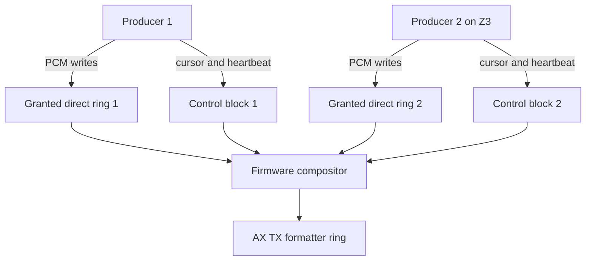
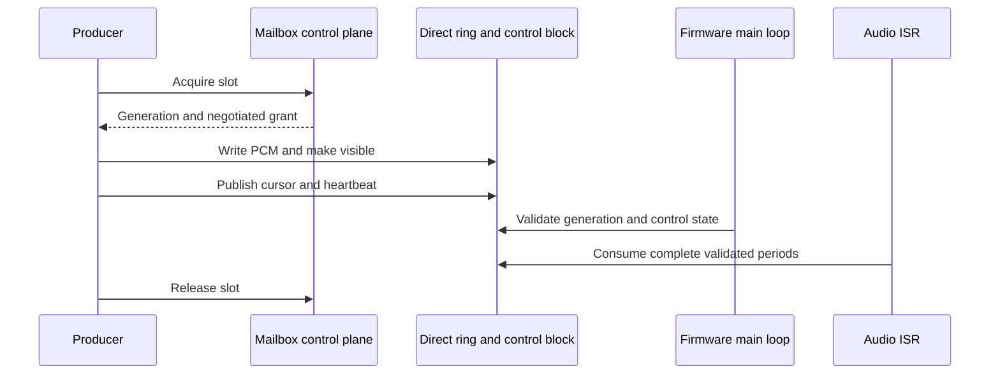

# Direct Audio Producer Rings - Plan

## Goal Capsule

- **Objective:** Independent ZZ9000 audio producers sustain concurrent playback without source starvation, audible drops, or synchronous mailbox throughput dependence.
- **Means:** Replace steady-state PCM copy submissions with negotiated host-visible producer rings and shared cursor publication.
- **Product authority:** This plan owns the direct-ring producer ABI, admission policy, lifecycle, and hardware qualification. Decoder behavior, scene DSP, and unrelated mailbox services remain outside scope.
- **Open blockers:** None before planning. Planning must ground the Zorro II fixed-memory reservation and cache protocol against the current memory map.

---

## Product Contract

### Summary

Introduce a direct shared-ring audio producer ABI. Clients write PCM into granted host-visible rings and publish producer state without synchronous mailbox calls in the steady data path.

### Problem Frame

The current unadvertised lease transport copies PCM through synchronous `AUDIO_LEASE_SUBMIT` calls. Two independent Amiga processes serialize complete calls through one global mailbox semaphore, including completion waits. Hardware qualification showed sustained source availability falling below one 3,840-byte period despite larger rings, earlier refills, and low compositor cost.

Measured failures ruled out ring overlap, audio ISR overload, interrupt coalescing, DMA-position jumps during the normal failure, and recurring shared-frontier rebases. Per-slot starvation remained the failing boundary.

### Key Decisions

- **New direct-ring ABI** (session-settled: user-directed — chosen over preserving existing clients: the synchronous copy-submit path cannot sustain two producers). Governs R1-R7.
- **Zorro III multi-slot and Zorro II single-slot admission** (session-settled: user-directed — chosen over two compact Zorro II slots: the 64-KiB host-visible window cannot provide safe two-slot reserve). Governs R8-R10.
- **Two-second heartbeat revocation** (session-settled: user-directed — chosen over explicit release only: crashed clients must not strand slots). Governs R11-R14.
- **Clean cutover from copy-submit leases.** The fabric capability is still unadvertised, so production clients migrate to one authoritative transport rather than carrying compatibility code. Governs R15.

### Actors

- A1. **Direct-ring producer:** An independent Amiga task that acquires one slot, writes PCM, publishes cursors and heartbeat state, and releases ownership.
- A2. **Firmware compositor:** Validates generations and cursors, consumes complete periods, mixes live sources, reports state, and revokes stale leases.
- A3. **Operator/tester:** Selects compatible firmware and clients, observes per-slot state, and performs Zorro III and Zorro II qualification.

### Requirements

**Negotiation and isolation**

- R1. Lease acquisition returns a generation-bound ring grant containing a host-visible location, capacity, period geometry, control-block location, and supported sample contract.
- R2. Every granted data and control range is non-overlapping with other slots, formatter rings, legacy audio scratch, boot memory, SDK allocators, and firmware-owned regions.
- R3. Clients derive all addresses and capacities from the grant; no client hard-codes board offsets or ring sizes.
- R4. Firmware rejects control state whose generation differs from the active lease; direct-ring isolation assumes cooperative clients because the Amiga aperture cannot revoke a stale task's physical write access.

**Steady data path**

- R5. After acquisition, PCM writes and producer-cursor publication require no synchronous mailbox request.
- R6. The producer publishes a write cursor only after the corresponding PCM bytes are visible to firmware under the control-block protocol in KTD1.
- R7. Firmware publishes a consumed cursor as ring credit, consumes only complete periods, rejects invalid cursor distance, and attributes starvation only to the affected slot.

**Bus-specific admission**

- R8. Zorro III advertises at least two independent direct-ring slots with enough reserve to pass AE1.
- R9. Zorro II advertises exactly one direct-ring slot with negotiated compact geometry and refuses a second acquisition deterministically.
- R10. Capability and grant results expose the actual slot count and geometry for the active bus mode.

**Lifecycle and recovery**

- R11. Each live or paused producer refreshes a shared heartbeat without entering the synchronous mailbox data path.
- R12. Firmware revokes a producer when its heartbeat has not advanced for two seconds; pause suppresses cursor progress but never suspends heartbeat expiry.
- R13. Revocation invalidates the generation, stops future consumption, and permits a new acquisition without a card reset.
- R14. Release, crash revocation, and warm reset permit at most one 20-ms residual period and cannot replay samples from an inactive generation.

**Migration and observability**

- R15. The direct-ring transport replaces the unadvertised copy-submit lease transport; obsolete submit opcodes, client paths, and compatibility branches are removed when the cutover lands.
- R16. Per-slot state reports generation, produced and consumed cursors, heartbeat/revocation state, starvation count, peak, and clip data without mutating playback state.
- R17. Capability advertising remains disabled until all required hardware acceptance examples pass.

### Key Flows

- F1. **Acquire and start**
  - **Actors:** A1, A2
  - **Steps:** Producer requests a slot; firmware admits by bus policy; firmware returns a generation-bound grant; producer initializes the ring and control block; producer publishes complete PCM periods and heartbeat state.
  - **Covered by:** R1-R6, R8-R10.
  - **Outcome:** Firmware can consume the producer without steady mailbox traffic.

- F2. **Steady playback**
  - **Actors:** A1, A2
  - **Steps:** Producer writes ahead; producer publishes its cursor; compositor snapshots the control block; compositor consumes complete periods and mixes the slot; state reads observe but do not pace playback.
  - **Covered by:** R5-R7, R16.
  - **Outcome:** Independent producers remain isolated and continuously audible.

- F3. **Crash recovery**
  - **Actors:** A1, A2
  - **Steps:** Producer stops refreshing heartbeat; firmware waits two seconds; firmware revokes the generation, rebuilds future queued periods, and permits a new producer to acquire the slot.
  - **Covered by:** R4, R11-R14.
  - **Outcome:** A crashed producer cannot strand the slot, and only the currently playing 20-ms period may remain audible.

### Acceptance Examples

- AE1. **Zorro III three-producer coexistence.** Covers R5-R8, R16-R17. Given a 44.1-kHz MHI pump and two independent direct-ring clients under sustained RTG load, when all run for at least 60 seconds, then all sources remain audible, per-slot starvation stays zero after activation, DMA frontier rebases do not recur, and no client depends on steady `STATE_GET` or copy-submit calls.
- AE2. **Zorro II admission.** Covers R9-R10. Given one active direct-ring producer on Zorro II, when a second client requests a slot, then firmware refuses it without altering the active producer; pump plus the admitted producer remain clean for at least 60 seconds.
- AE3. **Publication ordering.** Covers R4, R6-R7. Given PCM bytes not yet made visible, when a producer has not published the matching cursor, then firmware cannot consume them; after visibility and cursor publication, exactly those complete periods become eligible.
- AE4. **Invalid cursor.** Covers R7. Given a producer publishes a backward cursor or advances beyond ring capacity, when firmware snapshots the control block, then only that slot fails closed and other producers continue unchanged.
- AE5. **Crash revocation.** Covers R11-R14. Given a producer exits without release, when heartbeat age reaches two seconds, then firmware revokes the generation, rebuilds future queued periods, output loses at most the currently playing 20-ms period, and a new acquisition succeeds without reset.
- AE6. **Stale generation at reacquisition.** Covers R4, R14. Given old control data remains after revocation, when firmware grants a newer generation to a cooperative client, then firmware ignores the old generation and initializes the new control state before playback.
- AE7. **Warm reset.** Covers R4, R14. Given live direct producers, when the Amiga warm-resets, then future queued periods are rebuilt without inactive producers, old generations remain invalid, and output stays silent until a new producer starts.

### Success Criteria

- Zorro III passes B4 with zero steady-state source starvation and no audible artifacts for at least 60 seconds under RTG load.
- Zorro II passes pump-plus-one-direct-producer playback and deterministic second-slot refusal.
- The steady producer data path performs zero synchronous mailbox copy submissions and zero state polling required for pacing.
- Crash recovery reclaims a slot within two seconds plus one audio period.
- Existing qualified MHI/MPEG coexistence, AHI, Paula passthrough, capture, scene DSP, and warm-reset behavior remain intact.

### Scope Boundaries

- Preserve no compatibility shim for the unadvertised copy-submit lease ABI.
- Do not support two direct-ring producers on Zorro II in this delivery.
- Do not change decoder algorithms, sample-rate conversion quality, scene policy, or the overlay VDMA restart contract.
- Do not enable the fabric capability before hardware acceptance completes.
- Defer generalized zero-copy SDK services outside audio.

### Dependencies and Assumptions

- The active board mapping can expose a negotiated ring and control block to both the Amiga producer and firmware.
- Planning must prove cache visibility and memory ordering separately for Zorro III and Zorro II.
- Zorro II needs a dedicated one-slot reservation that does not consume or overlap the general 64-KiB host-window heap or legacy audio scratch.
- Firmware main-loop timekeeping can enforce heartbeat revocation without adding work to the audio ISR.

### Sources and Research

- `host/src/zz9k_host.c` — global Amiga mailbox semaphore and synchronous-call locking.
- `tools/zz9k-fabriclease.c` — current copy-submit proof client and failed refill experiments.
- `ZZ9000_proto.sdk/ZZ9000OS/src/audio_fabric.c` — compositor, per-slot starvation accounting, and qualification telemetry.
- `ZZ9000_proto.sdk/ZZ9000OS/src/audio_fabric_lease.c` — current lease lifecycle and card-side copied rings.
- `ZZ9000_proto.sdk/ZZ9000OS/src/memorymap.h` — formatter, host-window, Zorro III scratch, and fixed DDR reservations.
- External hardware captures `UART.txt` and `fabric-output.txt` established the throughput and starvation boundary; they are qualification evidence, not repository dependencies.

---

## Planning Contract

### Key Technical Decisions

- KTD1. **Use two ownership-separated 64-byte control lines with big-endian seqlocks.** The producer line publishes generation, write cursor, heartbeat, and flags; firmware invalidates then snapshots an even stable sequence. The firmware line publishes generation, consumed cursor, and status; firmware flushes after an even sequence commit. PCM writes precede the producer commit, and firmware invalidates only the newly credited PCM range. Governs R1, R4-R7, R11.
- KTD2. **Allocate rings through bus-aware firmware grants, not client constants.** Zorro III uses two large host-visible grants. Zorro II carves a fixed 48-KiB direct region from the existing 64-KiB host-window heap and leaves 16 KiB for the general allocator. Governs R1-R3, R8-R10.
- KTD3. **Keep direct-ring data outside the synchronous mailbox path.** Mailbox requests own acquisition, configuration, optional telemetry snapshots, and release only. Governs R5, R15-R16.
- KTD4. **Validate write-minus-consumed distance against capacity.** Firmware faults one generation on backward movement or outstanding distance above capacity without moving the shared TX frontier. Governs R4, R7, R14.
- KTD5. **Enforce heartbeat expiry in main-loop context.** The audio ISR reads only validated live source state; paused producers continue heartbeats. Governs R11-R14.
- KTD6. **Remove the copy-submit lease cutover completely.** The capability remains hidden until direct-ring qualification, so no compatibility shim or deprecated opcode path survives. Governs R15, R17.
- KTD7. **Retain per-slot contributions for queued TX periods.** On detach or revocation, firmware rebuilds every future queued period without the inactive slot; only the currently playing 20-ms period may remain. Governs R14.

### High-Level Technical Design

The SDK owns the public wire structures and grant validation. Firmware owns bus admission, physical range selection, generation state, control-block validation, heartbeat expiry, and compositor attachment.

Each producer grant contains one PCM ring and two ownership-separated control lines. The producer writes PCM, commits its write cursor and heartbeat through the producer seqlock, and reads firmware ring credits through the consumed-cursor seqlock. Firmware validates outstanding distance before exposing complete periods to the existing compositor source contract.

Zorro III grants two independent rings from host-visible memory outside legacy formatter and allocator ranges. Zorro II reserves 48 KiB from the existing host-window heap for one compact ring plus control block, reduces the general heap to 16 KiB, and updates the matched aperture-layout generation across firmware, SDK, FPGA layout metadata, and RTG driver.

### Implementation Constraints

- Preserve the existing `audio_fabric_source` snapshot, stage, and retire discipline so the compositor does not gain a second source model.
- Keep cache maintenance bounded by newly published ranges; never flush or invalidate an entire large ring per period.
- Encode shared fields as big-endian 32-bit words and use even/odd seqlocks for 64-bit cursors.
- Separate producer-owned and firmware-owned fields by cache line.
- Reject grants whose translated ranges are outside the active board aperture.
- Keep heartbeat expiry, admission, and teardown outside interrupt context.
- Remove the experimental frontier/starvation benchmark extensions after final qualification unless they remain behind `AUDIO_FABRIC_BENCH`.

### Sequencing

U1 precedes every consumer. U2 and U3 depend on the ABI. U4 starts after grant validation is stable. U5 depends on firmware and SDK lifecycle state. U6 consolidates host tests before hardware. U7 is the capability-advertising gate.

---

## Implementation Units

### U1. Define the direct-ring ABI

- **Goal:** Add generation-bound grant, ownership-separated control lines, bidirectional cursors, heartbeat, flags, and state-result vocabulary.
- **Requirements:** R1, R3-R7, R10-R12, R16.
- **Files:** SDK `include/zz9k/audio.h`, `include/zz9k/abi.h`, `host/include/zz9k/host.h`; firmware `ZZ9000_proto.sdk/ZZ9000OS/src/sdk_mailbox.h`.
- **Approach:** Replace copy-submit descriptors with acquire/release/state structures. Define big-endian producer and firmware seqlocks with cache-line alignment. Add size, offset, endian, and append-only ABI assertions.
- **Test scenarios:** Encode/decode round trips; malformed size and alignment; unstable seqlock; stale generation; cursor wrap past 32 bits; unknown flags.
- **Verification:** SDK ABI and request-builder host tests pass on little-endian host and m68k cross-build.

### U2. Reserve and negotiate bus-specific direct memory

- **Goal:** Provide two safe Zorro III grants and one safe compact Zorro II grant.
- **Requirements:** R1-R3, R8-R10.
- **Files:** Firmware `ZZ9000_proto.sdk/ZZ9000OS/src/memorymap.h` and aperture layout; SDK aperture validation; matched FPGA layout metadata and RTG driver reservation in their owning repositories.
- **Approach:** Reserve 48 KiB from the Zorro II host-window heap and reduce the general heap to 16 KiB under a new layout generation. Prove every direct range against formatter rings, boot ROM, legacy audio scratch, remaining SDK heaps, and aperture bounds. Return actual capacity and offsets.
- **Test scenarios:** Compile-time overlap failures; layout-generation mismatch; Z3 two-slot grants; Z2 one-slot grant; deterministic Z2 second-slot refusal; 16-KiB residual heap; invalid translated range.
- **Verification:** Memory-map, aperture-layout, driver-layout, and linker assertions pass for each matched build.

### U3. Implement firmware direct-ring producers

- **Goal:** Feed the existing compositor from direct producer rings without copy-submit mailbox work.
- **Requirements:** R4-R7, R13-R16.
- **Files:** Firmware `ZZ9000_proto.sdk/ZZ9000OS/src/audio_fabric_lease.c`, `audio_fabric.c`, `audio_fabric_internal.h`, mailbox dispatch.
- **Approach:** Adapt each direct lease to the existing producer operations. Validate both seqlocks, invalidate newly published PCM, stage complete periods, publish consumed credits, and retain per-slot queued contributions so detach can rebuild future TX periods.
- **Test scenarios:** Two independent ring sources; partial-period publication; ring wrap; backward cursor; capacity overrun; unstable control line; one fault while another continues; detach with six queued periods.
- **Verification:** Firmware fabric and lease suites pass with source isolation, credit publication, queued-period rebuild, and a 20-ms residual bound.

### U4. Add SDK direct-ring client APIs

- **Goal:** Let independent Amiga tasks acquire, map, write, publish, inspect, and release direct slots.
- **Requirements:** R1, R3-R6, R8-R10, R15-R16.
- **Files:** SDK host API implementation, public headers, `tools/zz9k-fabriclease.c`, request/reply tests.
- **Approach:** Validate grants before exposing pointers. Provide helpers for wrapped writes, PCM ordering, producer seqlock commits, firmware-credit snapshots, heartbeat refresh, and low-rate state telemetry. Remove copy-submit feeding.
- **Test scenarios:** Grant rejection; wrapped write; cursor publication after visibility; consumed-credit pacing; unstable firmware seqlock; independent contexts; Z2 second-client refusal; Ctrl-C release.
- **Verification:** Host contract tests pass; official AmigaOS 3 Docker build produces the proof client.

### U5. Add heartbeat and generation-safe recovery

- **Goal:** Reclaim crashed producers within two seconds without stale queued playback.
- **Requirements:** R4, R11-R14.
- **Files:** Firmware direct-lease lifecycle and queued-contribution state, SDK heartbeat helper, reset/teardown tests.
- **Approach:** Producer refreshes heartbeat in shared memory. Firmware main loop revokes expired generations and rebuilds every future queued TX period from retained live-slot contributions. Pause stops cursor progress only and continues heartbeat refresh.
- **Test scenarios:** Crash without release; deliberate pause longer than two seconds; expired paused client; stale generation at reacquisition; six queued mixed periods; warm reset; immediate reacquisition.
- **Verification:** Deterministic fake-clock and compositor tests prove timeout, pause, generation invalidation, queued-period rebuild, and the one 20-ms residual bound.

### U6. Complete cutover, diagnostics, and package

- **Goal:** Leave one authoritative direct-ring transport and a reproducible qualification package.
- **Requirements:** R15-R17.
- **Files:** SDK and firmware tests, hardware runbook, package manifest, obsolete opcode and client code.
- **Approach:** Remove copy-submit handlers, structures, tests, and documentation. Retain only compile-time-gated qualification telemetry needed by U7. Refresh all package hashes.
- **Test scenarios:** Old opcode rejection; capability remains hidden; no stale aliases or compatibility branches; package checksum verification.
- **Verification:** SDK host suite, firmware audio suite, both cross-builds, and checksum verification pass.

### U7. Qualify Zorro III and Zorro II hardware

- **Goal:** Prove direct-ring behavior before capability advertising.
- **Requirements:** R8-R10, R14, R16-R17.
- **Files:** Qualification results and runbook; production capability gate after recorded passes.
- **Approach:** Run AE1-AE7 on physical hardware. Capture client state and UART. Enable advertising only after all required rows pass.
- **Test scenarios:** AE1 under RTG load; Z2 pump plus one producer; second Z2 acquisition; crash timeout; cooperative stale generation; warm reset; AHI/MHI/Paula/capture regressions.
- **Verification:** Recorded zero-starvation 60-second runs, clean audible output, correct admission, and recovery evidence.

---

## Verification Contract

| Scope | Command or procedure | Proves |
|---|---|---|
| SDK host contract | Configure the existing CMake host build and run the direct-ring ABI/client tests | Grant parsing, cursor publication, pacing independence, cleanup |
| Firmware audio | `make test` in `test/audio` under WSL/Linux | Compositor parity, direct lease lifecycle, isolation, timeout |
| AmigaOS 3 build | `scripts/build-m68k-amigaos.ps1` with `sacredbanana/amiga-compiler:m68k-amigaos` | Public API and proof-client cross-build |
| Firmware images | `build_firmware_docker.ps1` for normal, benchmark, and three-source compositor variants | ARM firmware and boot images |
| Zorro III | AE1 plus AE3-AE7 on physical hardware for at least 60 seconds | Multi-producer throughput and recovery |
| Zorro II | AE2 plus applicable AE3-AE7 on physical hardware for at least 60 seconds | One-slot compact geometry and refusal |
| Package | Recompute `SHA256SUMS.txt` and confirm selected binaries with `certutil` | Artifact integrity |

No capability bit may be enabled while a required hardware row lacks a recorded pass.

---

## Definition of Done

- U1-U6 are committed in their owning repositories with no obsolete copy-submit path or compatibility shim.
- All R1-R17 requirements have at least one passing automated or hardware verification.
- Zorro III AE1 passes with the pump and two independent direct-ring producers, zero steady starvation, and no audible drops.
- Zorro II AE2 passes with one direct producer and deterministic refusal of a second.
- Crash, cooperative stale-generation, release, and warm-reset paths satisfy the two-second timeout and one 20-ms residual-period bound.
- Existing MHI/MPEG coexistence, AHI, Paula passthrough, capture, scene DSP, and overlay behavior remain qualified.
- Capability advertising is enabled only after the recorded hardware gate passes.
- Experimental code and superseded diagnostics from failed copy-submit approaches are removed or remain strictly benchmark-gated.
